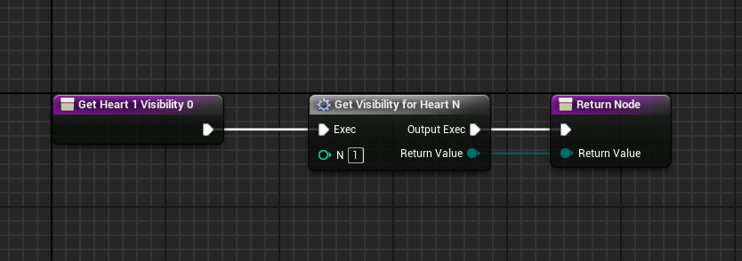

# Proyecto arcade alu0100969535

La mayoría del código y estructura del proyecto se ha basado en el siguiente repo: [https://github.com/iestevez/spaceinvaders](https://github.com/iestevez/spaceinvaders)

## Clases

Las clases c++ son:
- [ABullet](Source/arcade/Bullet.h)
- [AInvader](Source/arcade/Invader.h)
- [UInvaderMovementComponent](Source/arcade/InvaderMovementComponent.h)
- [AInvaderSquad](Source/arcade/InvaderSquad.h)
- [ASIGameModeBase](Source/arcade/SIGameModeBase.h)
- [ASIPawn](Source/arcade/SIPawn.h)
- [ASIPlayerController](Source/arcade/SIPlayerController.h)

## Blueprints

Los blueprints disponibles para modificar los valores por defecto y las meshes se pueden encontrar en [Content/Blueprints/](Content/Blueprints/)

## Proyectiles

Para los proyectiles se ha usado una static mesh creada con un brush de cilindro:

## Menu

El menu se ha hecho con el sistema de Widgets de Unreal, se han enlazado los botones a cargar el nivel1 o salir del juego

## HUD

Para el hud se ha usado el mismo sistema de widgets y se ha enlazado la puntuación a la variable de puntuación del SIPawn.

Para las vidas, se ha enlazado la visibilidad de cada sprite a la cantidad de vidas que tiene el SIPawn.

